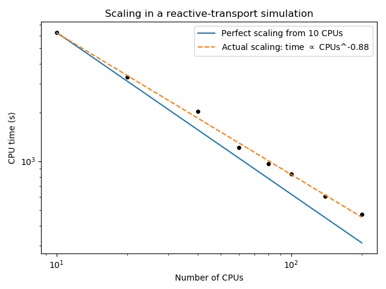
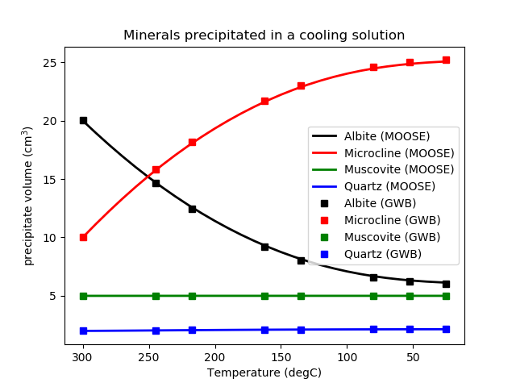
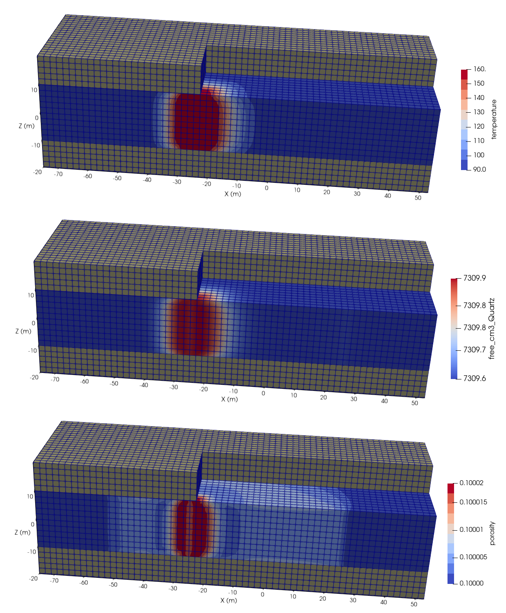

# Summary

Geochemical models are used to understand the chemistry of natural waters and other aqueous solutions and their interaction with minerals in many areas of practical interest, for example, geothermal wells and reservoirs, contaminant flow through aquifers, ore creation and mining techniques, petroleum and gas exploitation, and rock diagenesis.  The models are frequently extremely complicated, with thousands of interacting chemical species, and often require computer software to find the chemical concentrations.

Reactive transport simulations involve predicting the transport of chemical-species and temperature in a spatial domain (such as an aquifer) in addition to solving a chemical model at each point, at each time, in the domain.  Such models are used to explore spatio-temporal dependence of concentration, precipitation, dissolution, sorption, etc., and often require significant computational resources.  The complexity of simulations is greatly increased when deformation of the subsurface is also modelled: deformation may occur through flow processes (e.g., via thermal expansion) or chemical changes (e.g., via dissolution weakening the rock).

The MOOSE geochemistry module enables users to solve such models.

# Statement of need

Numerical modeling is essential to solve increasingly complicated problems, where the interplay between different physics, perhaps acting at different scales, is important.  For instance, understanding the impact of subsurface CO$_{2}$ injection (in carbon sequestration projects) can involve assessing the water-chemistry and rock-mineral changes resulting from temperature changes and the presence of CO$_{2}$, how these changes impact the porosity and permeability of the subsurface, and how the subsurface deforms and possibly fractures due to the injection.  Another example is understanding ore deposition, which commonly involves assessing how fluid and heat flows interact with geochemistry and tectonic features (e.g., faults) within the Earth's crust.  Similar remarks hold for hydraulic fracturing, aquifer thermal energy storage, in-situ leaching, and fossil fuel extraction using enhanced recovery techniques.

Researchers typically answer such questions using separate models for subsets of the physical processes, or loosely-coupled models solved using multiple software packages, or by employing a single software package such as [PFLOTRAN](https://www.pflotran.org/) [@pflotran-paper; @pflotran-user-ref] that contains all the desired features.  The MOOSE geochemistry module introduced here allows researchers to perform stand-alone geochemical modelling within the MOOSE framework, but also to draw upon the power of other MOOSE modules to solve complicated coupled transport, geomechanical and geochemical models using a single code.

# Existing software

A number of commercial and free (open or closed source) packages can solve reactive-transport models.  Some of these are:  [CrunchFlow](https://www.netl.doe.gov/sites/default/files/netl-file/CrunchFlow-Manual.pdf) [@steefel2015; @beisman2015]; the [Geochemist's Workbench](https://www.gwb.com/) [@bethke_2007]; [MIN3P](https://www.min3p.com/) [@su2020; @maher2019]; [PFLOTRAN](https://www.pflotran.org/) [@pflotran-paper; @pflotran-user-ref] and [TOUGHREACT](https://tough.lbl.gov/software/toughreact/) [@xu2004].  Others, such as [PHREEQC](https://www.usgs.gov/software/phreeqc-version-3/) [@pankhurst1995; @pankhurst1999] and [Reaktoro](https://reaktoro.org/) [@leal], have more limited transport capabilities, focussing instead on reactions.  Other initiatives, such as [OpenGeoSys](https://www.opengeosys.org/) [@kolditz2012; @bilke2019] and [PHAST](https://www.usgs.gov/software/phast-a-computer-program-simulating-groundwater-flow-solute-transport-and-multicomponent) [@pankhurst2010] focus on transport, and use external codes such as PHREEQC to perform the geochemical solve, while other codes such as [HP2](https://www.pc-progress.com/en/Default.aspx?h3d2-lib-hp2) [@simunek2012] couple together existing transport and reaction solvers.  @steefel2015 provides further code comparisons.  Many of these codes have been developed over decades by teams of researchers, and have sophisticated reaction-modelling capabilities, along with well-established GUIs to assist in model creation and the analysis of results.  Many of them have been used in hundreds of studies by thousands of researchers.

# Overview and comparisons with other software

The geochemistry module is built upon, and provided as part of, the open-source, massively parallel, fully implicit multiphysics simulation framework MOOSE (Multiphysics Object-Oriented Simulation Environment) [@permann2020moose].  MOOSE is an open-source library from Idaho National Laboratory that provides a high-level interface to the libMesh finite element library [@libmesh] and PETSc nonlinear solvers [@petsc-web-page; @petsc-user-ref; @petsc-efficient].  MOOSE and the geochemistry module follow [strict quality controls](https://mooseframework.org/sqa/index.html).  The geochemistry module's [test suite](https://mooseframework.inl.gov/application_development/test_system.html) contains over 350 tests, ranging from simple unit tests to fully-fledged benchmarks against the commercial [Geochemist's Workbench](https://www.gwb.com/) software.

As outlined in this article, the MOOSE geochemistry module can solve models involving aqueous geochemistry, including aqueous equilibrium, kinetics, oxidation-reduction, sorption and surface complexation, dissolution-precipitation and gas buffering.  One aspect that makes the geochemistry module different to the codes mentioned above is the ease of coupling additional physics to the geochemical functionality.  In particular, when used in conjuction with the MOOSE PorousFlow module [@Wilkins2020], sophisticated reactive-transport simulations may be performed, including multi-phase and unsaturated fluid flows, high-precision equations of state for fluids, dynamic porosity and permeability distributions, and sophisticated numerical stabilization.  Geomechanics may also be incorporated by using MOOSE's TensorMechanics module, to explore the interplay between geomechanical stresses and strains, and fluids, heat and reactions.  Fracturing of the skeleton material may also be included using MOOSE's XFEM module [@jiang2020ceramic; @zhang2018modified].  An additional advantage of MOOSE is that its APIs allow for easy modification of existing physics, or the addition of new physics.

Harnessing the power of MOOSE means that geochemistry simulations efficiently use multiprocessors and automatically utilize threading/OpenMP, without developers or users having to worry about the software technicalities (MOOSE scales well to over 100,000 cores).  From the user's perspective, a variety of integration schemes and unstructured meshes may be used.  Various time-stepping schemes may be employed.  A variety of I/O formats are available, such as Exodus and VTK files as well as CSV plaintext.  Users may utilize the "MultiApp" system that allows simulations to be embedded inside other simulations, which enables intuitive coupling of different physics at different spatio-temporal scales.  A generic GUI helps users create, run and analyse models.

Having said this, the aforementioned codes offer advantages too.  Some offer specialist features not available in the geochemistry module, while some of them include preprocessing and postprocessing capabilities that are far superior to the generic GUI offered by MOOSE.  Their learning curve may also be easier.

The geochemistry module's functionality is a subset of that described in the authoratative, pedagogical textbook by @bethke_2007.  It is not possible to describe all geochemical-modelling concepts in this short article, so the reader is referred to @bethke_2007 for further information.

For convenience, the source code for the geochemistry module is bundled within the MOOSE framework.  Detailed documentation of the module, its capability, and an extensive suite of examples can be found at https://mooseframework.org/modules/geochemistry/index.html.

# Reaction functionality

This section describes the types of geochemical reactions that the geochemistry module can solve.  Both equilibrium and kinetic reactions may be used in models solved by the geochemistry module.


## Database

The geochemical database defines the possible scope of geochemical models and includes information about all components and reactions.  The geochemistry module uses a database in a specific [JSON format](https://www.json.org).  The default database used in all geochemistry module examples and tests is a JSON version of the freely available January 2019 [LLNL thermodynamic database](https://www.gwb.com/thermo.php).    For convenience, a python script is provided to convert the popular [Geochemist's Workbench](https://www.gwb.com/) and EQ3/6 [@eq36] database formats to the required JSON format.

## Types of species and reactions

The user may select from the database a subset of chemical components and reactions that are relevant for their particular model.  These are:

- aqueous species in equilibrium;
- minerals in equilibrium with the aqueous solution that may precipitate or dissolve (a subset of all possible minerals may be chosen, and a user-supplied list of minerals may be prevented from precipitating);
- dissolved gases and gases in equilibrium with an external buffer such as the atmosphere (a subset of all possible gases may be used);
- species in alternative oxidation states (redox couples), and the user may set individual couples to be in equilibrium or disequilibrium with the aqueous solution;
- sorbed species in equilibrium with the aqueous solution, which are governed by a Langmuir approach or a surface-complexation approach that accounts for the electrical state of the porous-skeleton surface and how it varies with pH, ionic strength and solution composition;
- minerals, redox species and sorbed species whose dynamics are governed by kinetic rates.  Rates are sums of terms that may be dependent on the mass of kinetic species, a specific surface area, molality or activity of any promoting species, a temperature-dependent Arrhenius term, and the activity-product and equilibrium constant of the kinetic species.  The approach allows acid-neutral-alkali promotion as listed in the correlations prepared by @palandri to be used in geochemistry models, as well as many other types of rates.


## Activity and fugacity models

Only the Debye-Huckel B-dot model along with the related formulae for neutral species and water are coded into the geochemistry module.  The virial Pitzer/HMW models are not included.  The activity of all mineral species is assumed to be unity.  The Spycher-Reed [@spycher1988] fugacity formula [@toughreact; @prausnitz] is used in the geochemistry module.

## Constraints

A constraint must be supplied by the user for each member of the equilibrium basis in order that the geochemical system has a unique mathematical solution.  The following types of constraints are possible in the geochemistry module:

- For water: the mass of solvent water, or the total bulk mole number, or the activity;
- For aqueous basis species: the free molality, the total bulk number, or the activity (so that pH may be controlled, for instance);
- For precipitated minerals: the free (precipitated) mole number, or the total bulk mole number;
- For gases with fixed fugacity: fugacity
- For sorbing sites: the free molality of unoccupied sites, or the total bulk mole number.

In addition, all kinetic species must be provided with an initial mole number.

## Reaction paths

The following reaction paths are available in the geochemistry module:

- Adding reactants at user-defined rates.  These reactants may be basis species, secondary species, minerals, etc.
- Controlling temperature with a user-defined function.
- Changing temperature and altering the composition by adding cooler/hotter reactants at user-defined rates.
- Removing activity constraints on one or more species, or removing gas fugacity constraints, at user-supplied times.
- Controlling the activity of species (such as the pH) or gas fugacity with user-supplied functions.
- Discarding masses of any minerals present in the equilibrium solution (called a "dump" by @bethke_2007).
- Removing mineral masses at the end of each time-step (called "flow-through" by @bethke_2007)
- Adding pure H$_{2}$O and removing an equal mass of water components and solutes it contains (called "flush" by @bethke_2007).

Combinations of these may be used.  For instance, changing temperature while controlling the activity of species.

## Mathematical solution strategy

At each time-step, the geochemistry module calculates: the mass of solvent water; the molality of all aqueous species and dissolved gases; the mineral activity products and saturation indices; the mole number of precipitated minerals; the molality of unoccupied surface sites; the surface potentials; the molality of sorbed species; the mole number of kinetic species; and all activities and activity coefficients.  To achieve this, a fully-implicit, under-relaxed, iterative Newton-Raphson procedure is used.  Further information can be found [here](https://mooseframework.inl.gov/modules/geochemistry/theory/index.html).

During this procedure, care is taken to avoid numerical overflows or underflows.  Multiple sub-steps may be performed in each time-step to ensure good convergence.  Minerals are allowed to precipitate or dissolve during the procedure, with rates re-calculated at the beginning of every Newton-Raphson step.  Charge neutrality is enforced.

## Features not yet implemented

The geochemistry module's functionality allows it to handle most common modelling tasks, but a number of features have not yet been implemented.  These include the virial Pitzer/HMW activity models; certain kinetic rate forms used in biogeochemical modelling such as Michaelis–Menten and monod; the K$_{d}$ and Freundlich approaches to sorption; and isotopic fractionation.  The geochemistry module does not include a dedicated GUI to help with model creation and analysis.

# Reactive transport

One of the notable features of the MOOSE framework is the ability to couple different physics together.  Different types of couplings are available: tight (full) coupling; operator-splitting; etc.  To perform reactive-transport simulations using the geochemistry module, an operator-splitting approach must be used, in a sequential iterative or non-iterative approach (SIA or SNIA).  Users must therefore be careful with time-step sizes [@steefel2015].  Usually, MOOSE's PorousFlow module [@Wilkins2020] will be employed to simulate the transport (and any other non-geochemistry physics such as mechanics).  This means that each time-step involves a two-step process:

1. The PorousFlow module transports the solutes in the aqueous phase, as well as the temperature distribution.  A fully-implicit approach is used to solve the transport, but note that the chemical reactions are held fixed during this stage.  The result provides the temperature and extra chemical source terms (to be added to the geochemical equations) at each point in the spatial domain.  The extra source terms are the total component concentrations of the transporting species.
2. With these sources, the geochemistry module solves for the mole numbers of each species at each point in the spatial domain, using the Newton-Raphson method mentioned in the previous section.  During this stage, the non-geochemistry physics (transport, mechanics, etc.) is held fixed.

It is easy to use multiple sub-steps within (1) and/or (2), which may be necessary if the time-scales of the transport and chemical reactions are very different.  It is also possible to iterate (1) and (2) in a "SIA" approach [@steefel2015].  The operator-split approach is also used by other reactive-transport solvers, such as the [Geochemist's Workbench](https://www.gwb.com/).

The PorousFlow module is a sophisticated multi-component, multi-phase transport code, and employing it means:

- pressure and temperature are tightly coupled with fluid flows
- densities, viscosities, etc., may depend on solute concentrations, temperature and pressure
- porosity and permeability can change with precipitation and dissolution
- multiphase flows can be used
- coupling with sophisticated geomechanics (including plasticity [@adhikary2016robust; @wilkins2020method], fracture and large strains) is straightforward
- sophisticated numerical stabilization is available.

For users not wishing to employ the PorousFlow module, a rudimentary transport capability has been included in the geochemistry module, which models advective-diffusive transport of the mobile concentrations, with hydrodynamic dispersion.  It is assumed that precipitated minerals, sorbed species and sorption sites are immobile.  The temperature, porosity, Darcy flux vector and dispersion tensor are fixed by the user.  All of these may vary spatially and temporally, but the geochemistry module provides them with no dynamics (in contrast with the PorousFlow module, where temperature evolution is governed by an advection-diffusion equation, for instance).  An operator-splitting method provides the mathematical solution, as described above.

# Computational aspects

Spatially-varying geochemistry simulations use a large amount of memory since they store information about a complete geochemical system at each finite-element node (irrespective of the finite-element type).  On the other hand, ignoring transport, they are almost embarrasingly parallel, and can be solved efficiently using a large number of processors.  Even reactive-transport models scale well with multiple processors, since multi-component flow in porous media is essentially multiple coupled diffusion equations.  \autoref{fig:scaling_eg} shows an example of scaling in which an operator-split model of fixed size and fixed number of time-steps is run on multiple processors.  Further experiments involving memory usage, solver choices and cpu-scaling can be found in the [online documentation](https://mooseframework.org/modules/geochemistry/theory/compute_efficiencies.html).

{ width=60% }

# Building and using the code

Building the geochemistry module is a two-step process:

1. Download and install the entire MOOSE package.  Detailed instructions are at the [MOOSE website](https://mooseframework.inl.gov/getting_started/installation/index.html).  Even if only geochemistry is of interest (without transport, solid mechanics, etc.) MOOSE comes as a complete package, so needs to be installed in its entirety.  Depending on the computer setup, this can be straightfoward (on a personal Mac computer) or complicated (on an administered supercomputer).

2. During the installation of MOOSE in part 1, only the "framework" will have been compiled.  To compile any of the physics modules, including the geochemistry module, use the following instructions run from the command line:
```
cd ~/projects/moose/modules
make
cd ~/projects/moose/modules/geochemistry
make
cd ~/projects/moose/modules/geochemistry/unit
make
```
(If your computer has $N$ cores, the `make` process may be sped up by using the command `make -j`$N$ instead of simply `make`.)

Check that the geochemistry module is correctly compiled using the following instructions:
```
cd ~/projects/moose/modules/geochemistry/unit
./run_tests
cd ~/projects/moose/modules/geochemistry
./run_tests
```
Virtually all the tests should run and pass.  Some may be "skipped" due to a particular computer setup (for instance, not enough threads).  (If your computer has $N$ cores, the `run_tests` command may be sped up by using the command `./run_tests -j`$N$ instead of simply `./run_tests`.)

The geochemistry executable is called `geochemistry-opt` and is found at `~/projects/moose/modules/geochemistry`.  This may be used to run pure geochemistry simulations.  For example, to run the [cooling a solution in contact with feldspars example](https://mooseframework.inl.gov/modules/geochemistry/tests_and_examples/cooling_feldspar.html) from the command line, use:
```
cd ~/projects/moose/modules/geochemistry/test/tests/time_dependent_reactions
../../../geochemistry-opt -i cooling.i
```
For coupled reactive-transport simulations using the PorousFlow module, the `combined-opt` executable must be used.  For example, to run the [Weber-Tensleep GeoTES example](https://mooseframework.org/modules/geochemistry/tests_and_examples/geotes_weber_tensleep.html) from the command line, use:
```
cd ~/projects/moose/modules/combined/examples/geochem-porous_flow/geotes_weber_tensleep
../../../combined-opt -i exchanger.i
```

# Tests and examples

The geochemistry module's [code coverage](https://mooseframework.inl.gov/docs/coverage/geochemistry/index.html) currently exceeds 96%.  Many of the more complicated benchmark tests against the Geochemist's Workbench code and the examples are [comprehensively documented](https://mooseframework.inl.gov/modules/geochemistry/tests_and_examples/index.html).  The sections below present one benchmark study and one example by way of illustration.

# Benchmark: cooling with feldspars

One of the geochemistry tests and examples involves slowly cooling an aqueous solution from 300$^{\circ}$C to 25$^{\circ}$C, and details can be found [here](https://mooseframework.inl.gov/modules/geochemistry/tests_and_examples/cooling_feldspar.html).  The aqueous solution is in equilibrium contact with albite, maximum microcline, muscovite and quartz.  This example is documented in Section 14.1 of @bethke_2007.  \autoref{fig:feldspar_eg} shows the comparison of the results from MOOSE's geochemistry module and the Geochemist's Workbench.

{ width=60% }

# Example: reactive transport in an aquifer thermal energy storage scenario

The Weber-Tensleep Formation in the USA has been proposed to store renewably-generated, high-temperature water, for later use in electricity generation [@seedling; @osti_1524048].  During the storage phase, formation water from the reservoir is produced, heated to 160$^{\circ}$C under pressure, and re-injected.  The cycle is reversed during electricity generation.  A [3D reactive transport study](https://mooseframework.org/modules/geochemistry/tests_and_examples/geotes_weber_tensleep.html) assessing potential precipitates in the engineering equipment, and mineralogy changes around the hot-water injection well in the deep reservoir, is provided as one of the geochemistry module examples.

The major ions in the Weber-Tensleep Formation water are Cl$^{-}$, Na$^{+}$, SO$_{4}^{2-}$, HCO$_{3}^{-}$, K$^{+}$, Ca$^{2+}$ and HS$^{-}$, with a host of additional minor ions.  The pH is around 6.5, the ionic strength is around 1.7$\,$mol.kg$^{-1}$ (which is close to the limit of 3$\,$mol.kg$^{-1}$ for the Debye-Huckel activity model [@bethke_2007]), and the temperature around 90$^{\circ}$C.  The observed mineralogy involves quartz (80\%), K-feldspar (8\%), Calcite (5\%), Siderite and Dolomite (each 2\%), Fe-chlorite and Illite (each 1\%) and a host of trace minerals.

The 3D MOOSE model involves coupling 3 models representing: (1) the heat exchanger; (2) injection, production and transport of water through the formation; (3) a geochemical model of the reservoir.  These three models are loosely coupled using MOOSE's "multiapp" approach, using the geochemistry (for chemistry) and PorousFlow (for transport) modules.  The coupled modelling reveals that anhydrite is the main precipitate in the heat exchanger, that illite and kaolinite dissolve around the injection well, and that K-feldspar and quartz precipitate around the injection well.  \autoref{fig:weber_tensleep_eg} illustrates the results.  (These results are derived using a higher resolution than the example included in the test suite, since the latter must be small enough to rapidly pass MOOSE's automatic regression testing.)




# Acknowledgements

The authors thank the MOOSE framework team, past and present, for providing the MOOSE framework and auxiliary functionality (quality control, test harnesses, documentation scaffolds, build scripts, etc.). The manuscript review provided by Ghanashyam (Hari) Neupane and the two CSIRO internal reviewers is also greatly appreciated.

This research made use of the resources of the High Performance Computing Center at Idaho National Laboratory, which is supported by the Office of Nuclear Energy of the U.S. Department of Energy and the Nuclear Science User Facilities under Contract No. DE-AC07-05ID14517.

# References
